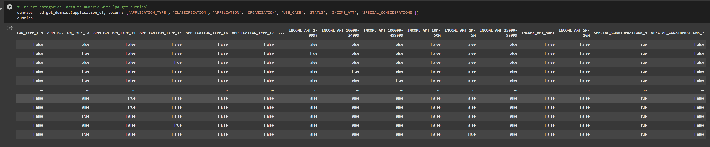
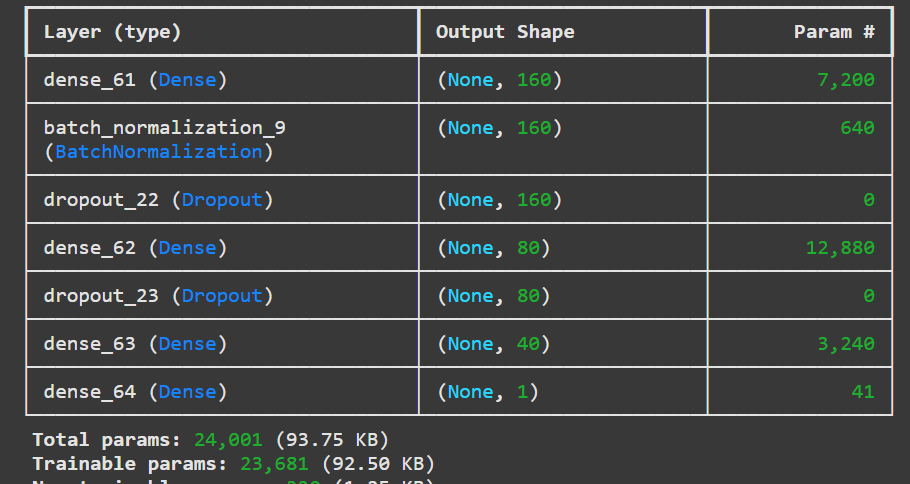
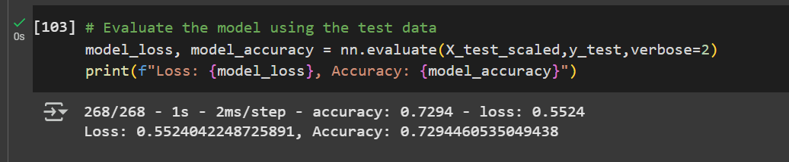

## deep-learning-challenge
# FILES IN REPO:
'README' contains the report of the model
'AlphabetSoupCharity_Optimization.ipynb' this is my raw code that was used to construct the model 
'charity_model.h5' is the neural network model

# INTRODUCTION:
The purpose of the analysis to help the nonprofit foundation select the applicants that have the best chance of success in their ventures based on data from previous applicants. We created a neural network that was trained on the data provided to predict where the applicants will be success. We were able to predict accurately about 73% of the time which weeds out a lot of the applicants right away, which can help get through applications faster especially if there was many applications in that particular year. 

# DATA PREPROCESSING:
The variable that was the target for this model was whether the venture was successful or not which would indicate if the organization used the money effectively. The value in column “IS_SUCCESSFUL”  is either a 0 or a 1. 

The features of this model were the following: 'APPLICATION_TYPE', 'CLASSIFICATION', 'AFFILIATION', 'ORGANIZATION', 'USE_CASE', 'STATUS', 'INCOME_AMT', and 'SPECIAL_CONSIDERATIONS'. All of these columns were categorical except ‘INCOME_AMT’ each of them had unique values of less than 10 which means they were adequate to use. ‘INCOME_AMT’ was standardized since it was numerical. The other features were turned into dummies. 

EIN and NAME were removed because they were neither targets or features that would have affected the outcome of the whether or not the organizations venture was successful. 

# COMPILING, TRAINING and EVALUATING the Model:
I played a lot with the neurons, layers and activation on this model to see how it could affect accuracy. The model that I ended up using 280 neurons and 3 hidden layers (4 if we are including the output layer). I ended up using “relu” for the hidden layers and “sigmoid” for the output layer. 

I was not able to achieve the target model performance of 75% but I got really close to 73%. Initially I was get 62% but then I realized that I had set up the dummies incorrectly. I was initially dropping most of the columns which was not a good idea. Once I fixed the dummies I was able to get above the threshold. I tried dropping other columns that I thought I might not need like “Special_Considerations” but it ended up reducing the accuracy slightly so I added it back in. I tried balancing the weights of the target (seeing if maybe the model was off because there were more 1 v 0 or vice versa). It did not help much. I also tried to see which features mattered the most but it was making me drop certain categorical columns and keeping others which I think could have potentially made for a bad model.

# RESULTS:
The results for this model was that it could predict with accuracy 73% of the time what kind of applicant would be successful in using the money correctly for their venture, which I think is pretty high. I think this model could be improved upon but it could be used to determine which applicants will be successful. I would want to try a random forest regression model because the data is well structured, because random forest doesn't require preprocessing. NN might also become overly trained with the training data which can cause it to overfit on smaller datasets. 
